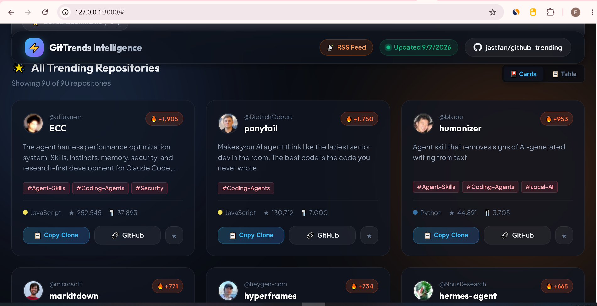

<div align="center">

# ⚡ GitTrends AI — Open Agent Intelligence Registry

**World-class Swiss Editorial developer registry and empirical research desk for Claude Code skills, MCP servers, and GitHub star velocity intelligence.**

[](https://jastfan.github.io/github-trending/)
[](https://www.npmjs.com/package/gittrends-mcp)
[](guides/mcp_servers_integration.md)
[](data/research/census_latest.json)
-2ea44f?style=for-the-badge&logo=github)


<sub>⚡ 79,848+ Listings • 164.8M Installs • Auto-updated 2x daily via GitHub Actions • Maintained by [@jastfan](https://github.com/jastfan/github-trending)</sub>

<br/>

```bash
# ⚡ 1-Click Coding Agent Integration (mid-task skill discovery for Claude Code & Cursor)
claude mcp add gittrends -- npx -y gittrends-mcp
```

<br/>
<a href="https://jastfan.github.io/github-trending/"></a>

<sub>👉 <b><a href="https://jastfan.github.io/github-trending/">Launch the Live Swiss Editorial Registry</a></b> with 4 Numbered Leaderboards, Interactive Inspector, Side-by-Side Comparison Matrix, and Terminal Prompt Simulator.</sub>

---

### 🧭 Registry Navigation

[`🌐 Live Web App`](https://jastfan.github.io/github-trending/) • [`⚡ Popular Skills`](#-hot-ai-llms-mcp--agent-skills-spotlight) • [`🔌 MCP Servers`](guides/mcp_servers_integration.md) • [`📊 Research Censuses`](data/research/census_latest.json) • [`📚 Developer Guides`](guides/README.md) • [`📡 RSS Feed`](feed.xml) • [`🗄️ JSON API`](#-structured-data-access-api)

<br/>

<table align="center" width="100%">
  <tr>
    <td align="center" width="25%"><b>🏆 4 Editorial Leaderboards</b><br/><sub>Skills, MCP, Hubs &amp; Velocity</sub></td>
    <td align="center" width="25%"><b>🔌 Native MCP Server</b><br/><sub>5 tools for autonomous agents</sub></td>
    <td align="center" width="25%"><b>📊 Empirical Research Desk</b><br/><sub>5 dated ecosystem censuses</sub></td>
    <td align="center" width="25%"><b>⚡ Live Agent Simulator</b><br/><sub>Terminal prompt testbench</sub></td>
  </tr>
</table>

</div>

---

## 🏆 Today's #1 Trending Breakout Project

[](https://github.com/debpalash/VoiceStudio)

> 💡 **What is it?** [debpalash/VoiceStudio](https://github.com/debpalash/VoiceStudio) — VoiceStudio is the open-source, fully-local ElevenLabs alternative — voice cloning, voice design, video dubbing, dictation, transcription & audiobook creation in 646 languages.
> 🚀 **Gained today:** **+3,483 stars** | **Total Stars:** ★ 50,718 | **Topics:** `#AI-Video`

<details>
<summary><b>👉 Click here for Instant Quick Inspect (Clone command & details)</b></summary>

```bash
# Clone this breakout repository directly:
git clone https://github.com/debpalash/VoiceStudio.git
```
- **Repository URL:** [https://github.com/debpalash/VoiceStudio](https://github.com/debpalash/VoiceStudio)
- **Owner:** `@debpalash`
</details>

---

## 🔥 Today's Top 5 Breakout Repositories (Viral Momentum)

> Repositories with the highest star velocity across the entire GitHub ecosystem in the last 24 hours.

| Rank | Repository | Language | Trending Topics | Stars Today | Total Stars | Description |
| :---: | :--- | :---: | :---: | :---: | :---: | :--- |
| 1 | [**debpalash/VoiceStudio**](https://github.com/debpalash/VoiceStudio) | `Python` | `#AI-Video` | 🔥 **+3,483** | ★ 50,718 | VoiceStudio is the open-source, fully-local ElevenLabs alternative — voice cloning, voice design, video dubbing, dictation, transcription & audiobook creation in 646 languages. |
| 2 | [**NVIDIA/OpenShell**](https://github.com/NVIDIA/OpenShell) | `Rust` | `#Coding-Agents` | 🔥 **+1,281** | ★ 13,106 | OpenShell is the safe, private runtime for autonomous AI agents. |
| 3 | [**rohitg00/ai-engineering-from-scratch**](https://github.com/rohitg00/ai-engineering-from-scratch) | `Python` | - | 🔥 **+1,205** | ★ 62,197 | Learn it. Build it. Ship it for others. |
| 4 | [**t8y2/dbx**](https://github.com/t8y2/dbx) | `Rust` | `#MCP` | 🔥 **+1,138** | ★ 23,386 | 25 MB lightweight cross-platform database client for 100+ databases, including MySQL, PostgreSQL, SQLite, Redis, MongoDB, DuckDB, SQL Server, and Dameng. Built-in AI, MCP Server, CLI, desktop and Docker. \| 轻量级跨平台数据库管理工具，支持 MySQL、PostgreSQL、SQLite、Redis、MongoDB、达梦等 100+ 数据库，提供桌面端、Docker、CLI、内置 AI 助手和 MCP。 |
| 5 | [**VectifyAI/PageIndex**](https://github.com/VectifyAI/PageIndex) | `Python` | - | 🔥 **+1,097** | ★ 38,232 | 📑 PageIndex: Document Index for Vectorless, Reasoning-based RAG |

---

## 🤖 Hot AI, LLMs, MCP & Agent Skills Spotlight

> Curated breakthroughs in Model Context Protocol (MCP), Agentic Frameworks, AI Video Generation, and Local LLMs.

| Rank | AI Repository | Language | Key Topic | Stars Today | Total Stars | What It Does |
| :---: | :--- | :---: | :---: | :---: | :---: | :--- |
| 1 | [**debpalash/VoiceStudio**](https://github.com/debpalash/VoiceStudio) | `Python` | `#AI-Video` | 🔥 **+3,483** | ★ 50,718 | VoiceStudio is the open-source, fully-local ElevenLabs alternative — voice cloning, voice design, video dubbing, dictation, transcription & audiobook creation in 646 languages. |
| 2 | [**NVIDIA/OpenShell**](https://github.com/NVIDIA/OpenShell) | `Rust` | `#Coding-Agents` | 🔥 **+1,281** | ★ 13,106 | OpenShell is the safe, private runtime for autonomous AI agents. |
| 3 | [**t8y2/dbx**](https://github.com/t8y2/dbx) | `Rust` | `#MCP` | 🔥 **+1,138** | ★ 23,386 | 25 MB lightweight cross-platform database client for 100+ databases, including MySQL, PostgreSQL, SQLite, Redis, MongoDB, DuckDB, SQL Server, and Dameng. Built-in AI, MCP Server, CLI, desktop and Docker. \| 轻量级跨平台数据库管理工具，支持 MySQL、PostgreSQL、SQLite、Redis、MongoDB、达梦等 100+ 数据库，提供桌面端、Docker、CLI、内置 AI 助手和 MCP。 |
| 4 | [**VectifyAI/PageIndex**](https://github.com/VectifyAI/PageIndex) | `Python` | `#AI` | 🔥 **+1,097** | ★ 38,232 | 📑 PageIndex: Document Index for Vectorless, Reasoning-based RAG |
| 5 | [**mattpocock/skills**](https://github.com/mattpocock/skills) | `Shell` | `#Agent-Skills` | 🔥 **+876** | ★ 273,176 | Skills for Real Engineers. Straight from my .agents directory. |
| 6 | [**DietrichGebert/ponytail**](https://github.com/DietrichGebert/ponytail) | `JavaScript` | `#Coding-Agents` | 🔥 **+743** | ★ 149,425 | Makes your AI agent think like the laziest senior dev in the room. The best code is the code you never wrote. |

---

## 📊 Language Category Dashboards

### 🌐 Overall Trending

| # | Repository | Language | Topics | Stars Today | Total Stars | Description |
| :---: | :--- | :---: | :---: | :---: | :---: | :--- |
| 1 | [**NVIDIA/OpenShell**](https://github.com/NVIDIA/OpenShell) | `Rust` | `#Coding-Agents` | **+1,281** | ★ 13,106 | OpenShell is the safe, private runtime for autonomous AI agents. |
| 2 | [**debpalash/VoiceStudio**](https://github.com/debpalash/VoiceStudio) | `Python` | `#AI-Video` | **+3,483** | ★ 50,718 | VoiceStudio is the open-source, fully-local ElevenLabs alternative — voice cloning, voice design, video dubbing, dictation, transcription & audiobook creation in 646 languages. |
| 3 | [**mvschwarz/openrig**](https://github.com/mvschwarz/openrig) | `TypeScript` | `#Coding-Agents` | **+624** | ★ 3,168 | Multi-agent harness that runs Claude Code and Codex together as one system |
| 4 | [**mksglu/context-mode**](https://github.com/mksglu/context-mode) | `TypeScript` | `#MCP` `#Coding-Agents` | **+90** | ★ 24,554 | Context window optimization for AI coding agents. Sandboxes tool output (98% reduction), persists session memory, and enforces routing across 17 platforms via MCP + hooks. |
| 5 | [**DietrichGebert/ponytail**](https://github.com/DietrichGebert/ponytail) | `JavaScript` | `#Coding-Agents` | **+743** | ★ 149,425 | Makes your AI agent think like the laziest senior dev in the room. The best code is the code you never wrote. |
| 6 | [**harry0703/MoneyPrinterTurbo**](https://github.com/harry0703/MoneyPrinterTurbo) | `Python` | `#AI-Video` `#Local-AI` | **+431** | ★ 127,668 | 利用 AI 大模型和自动化工作流，根据主题或关键词一键生成高清短视频。Generate HD short videos from a topic or keyword with an automated AI workflow. |
| 7 | [**openclaw/openclaw**](https://github.com/openclaw/openclaw) | `TypeScript` | - | **+136** | ★ 391,041 | The AI that really does things. Any OS. Any Platform. The lobster way. 🦞 |
| 8 | [**ComposioHQ/awesome-claude-skills**](https://github.com/ComposioHQ/awesome-claude-skills) | `Python` | `#Agent-Skills` | **+123** | ★ 76,207 | A curated list of awesome Claude Skills, resources, and tools for customizing Claude AI workflows |

> 📂 *Explore all 17 Overall Trending repos in [`archives/2026-10/2026-10-01.md`](archives/2026-10/2026-10-01.md)*

### 🐍 Python

| # | Repository | Language | Topics | Stars Today | Total Stars | Description |
| :---: | :--- | :---: | :---: | :---: | :---: | :--- |
| 1 | [**debpalash/VoiceStudio**](https://github.com/debpalash/VoiceStudio) | `Python` | `#AI-Video` | **+3,483** | ★ 50,718 | VoiceStudio is the open-source, fully-local ElevenLabs alternative — voice cloning, voice design, video dubbing, dictation, transcription & audiobook creation in 646 languages. |
| 2 | [**harry0703/MoneyPrinterTurbo**](https://github.com/harry0703/MoneyPrinterTurbo) | `Python` | `#AI-Video` `#Local-AI` | **+431** | ★ 127,668 | 利用 AI 大模型和自动化工作流，根据主题或关键词一键生成高清短视频。Generate HD short videos from a topic or keyword with an automated AI workflow. |
| 3 | [**ComposioHQ/awesome-claude-skills**](https://github.com/ComposioHQ/awesome-claude-skills) | `Python` | `#Agent-Skills` | **+123** | ★ 76,207 | A curated list of awesome Claude Skills, resources, and tools for customizing Claude AI workflows |
| 4 | [**VectifyAI/PageIndex**](https://github.com/VectifyAI/PageIndex) | `Python` | - | **+1,097** | ★ 38,232 | 📑 PageIndex: Document Index for Vectorless, Reasoning-based RAG |
| 5 | [**VectifyAI/OpenKB**](https://github.com/VectifyAI/OpenKB) | `Python` | - | **+24** | ★ 4,690 | OpenKB: Open LLM Knowledge Base |
| 6 | [**ifixai-ai/iFixAi**](https://github.com/ifixai-ai/iFixAi) | `Python` | `#Coding-Agents` | **+340** | ★ 17,710 | Independent Auditing of AI Agents. Run by human or the agent itself, to answer the most crucial question in the AI Agent Economy. Is the agent doing what is supposed to do? With iFixAi you can have this answer in less than 120 seconds. |
| 7 | [**TencentCloud/Octop**](https://github.com/TencentCloud/Octop) | `Python` | `#Coding-Agents` | **+285** | ★ 6,134 | A smarter, self-hosted AI assistant — multi-user, multi-agent. |
| 8 | [**LibreTranslate/LibreTranslate**](https://github.com/LibreTranslate/LibreTranslate) | `Python` | `#Local-AI` | **+35** | ★ 16,967 | Free and Open Source Machine Translation API. Self-hosted, offline capable and easy to setup. |

> 📂 *Explore all 19 Python repos in [`archives/2026-10/2026-10-01.md`](archives/2026-10/2026-10-01.md)*

### ⚡ JavaScript

| # | Repository | Language | Topics | Stars Today | Total Stars | Description |
| :---: | :--- | :---: | :---: | :---: | :---: | :--- |
| 1 | [**DietrichGebert/ponytail**](https://github.com/DietrichGebert/ponytail) | `JavaScript` | `#Coding-Agents` | **+743** | ★ 149,425 | Makes your AI agent think like the laziest senior dev in the room. The best code is the code you never wrote. |
| 2 | [**byoungd/up**](https://github.com/byoungd/up) | `JavaScript` | - | **+743** | ★ 66,495 | An advanced guide which might benefit you a lot 🎉 . 韩先凯的人生进阶指南 人生进阶指南 离谱的人生 人生进阶 AI学习 AI指南 韩先凯的AI学习指南 英语学习指南/英语学习教程/英语学习/学英语 |
| 3 | [**pbakaus/impeccable**](https://github.com/pbakaus/impeccable) | `JavaScript` | - | **+463** | ★ 73,142 | The design language that makes your AI harness better at design. |
| 4 | [**affaan-m/ECC**](https://github.com/affaan-m/ECC) | `JavaScript` | `#Agent-Skills` `#Coding-Agents` `#Security` | **+664** | ★ 270,294 | The agent harness performance optimization system. Skills, instincts, memory, security, and research-first development for Claude Code, Codex, Opencode, Cursor and beyond. |
| 5 | [**open-gsd/gsd-core**](https://github.com/open-gsd/gsd-core) | `JavaScript` | - | **+41** | ★ 10,052 | Git. Ship. Done - Core |
| 6 | [**NomaDamas/k-skill**](https://github.com/NomaDamas/k-skill) | `JavaScript` | `#Agent-Skills` | **+6** | ★ 7,731 | 한국인을 위한 스킬 모음집 - 에이전트를 한국인으로 |
| 7 | [**WesselKroos/youtube-ambilight**](https://github.com/WesselKroos/youtube-ambilight) | `JavaScript` | `#AI-Video` | **+41** | ★ 235 | This browser extension adds ambient light to YouTube videos |
| 8 | [**mokshablr/gander**](https://github.com/mokshablr/gander) | `JavaScript` | `#AI-Video` `#Local-AI` | **+14** | ★ 1,115 | Take a gander at any file. Offline, zero-permission Android viewer for PDF, Word, Excel, PowerPoint, photos, video, audio, Markdown and code. |

> 📂 *Explore all 17 JavaScript repos in [`archives/2026-10/2026-10-01.md`](archives/2026-10/2026-10-01.md)*

### 🔷 TypeScript

| # | Repository | Language | Topics | Stars Today | Total Stars | Description |
| :---: | :--- | :---: | :---: | :---: | :---: | :--- |
| 1 | [**mvschwarz/openrig**](https://github.com/mvschwarz/openrig) | `TypeScript` | `#Coding-Agents` | **+624** | ★ 3,168 | Multi-agent harness that runs Claude Code and Codex together as one system |
| 2 | [**mksglu/context-mode**](https://github.com/mksglu/context-mode) | `TypeScript` | `#MCP` `#Coding-Agents` | **+90** | ★ 24,554 | Context window optimization for AI coding agents. Sandboxes tool output (98% reduction), persists session memory, and enforces routing across 17 platforms via MCP + hooks. |
| 3 | [**openclaw/openclaw**](https://github.com/openclaw/openclaw) | `TypeScript` | - | **+136** | ★ 391,041 | The AI that really does things. Any OS. Any Platform. The lobster way. 🦞 |
| 4 | [**heygen-com/hyperframes**](https://github.com/heygen-com/hyperframes) | `TypeScript` | `#Coding-Agents` `#AI-Video` | **+349** | ★ 54,864 | Write HTML. Render video. Built for agents. |
| 5 | [**modelcontextprotocol/servers**](https://github.com/modelcontextprotocol/servers) | `TypeScript` | - | **+50** | ★ 90,856 | Model Context Protocol Servers |
| 6 | [**oblien/openship**](https://github.com/oblien/openship) | `TypeScript` | - | **+581** | ★ 14,232 | Self-hosted deployment platform |
| 7 | [**firecrawl/firecrawl**](https://github.com/firecrawl/firecrawl) | `TypeScript` | `#Coding-Agents` | **+555** | ★ 187,258 | 🔥 Supercharge your AI agents with data from the web and beyond. A web data API to search, scrape, and access more sources. |
| 8 | [**ChromeDevTools/chrome-devtools-mcp**](https://github.com/ChromeDevTools/chrome-devtools-mcp) | `TypeScript` | `#MCP` `#Coding-Agents` | **+73** | ★ 52,825 | Chrome DevTools for coding agents |

> 📂 *Explore all 15 TypeScript repos in [`archives/2026-10/2026-10-01.md`](archives/2026-10/2026-10-01.md)*

### 🐹 Go

| # | Repository | Language | Topics | Stars Today | Total Stars | Description |
| :---: | :--- | :---: | :---: | :---: | :---: | :--- |
| 1 | [**aquasecurity/trivy**](https://github.com/aquasecurity/trivy) | `Go` | `#Local-AI` | **+19** | ★ 38,162 | Find vulnerabilities, misconfigurations, secrets, SBOM in containers, Kubernetes, code repositories, clouds and more |
| 2 | [**infiniflow/ragflow**](https://github.com/infiniflow/ragflow) | `Go` | `#Coding-Agents` `#Local-AI` | **+62** | ★ 91,566 | RAGFlow is a leading open-source Retrieval-Augmented Generation (RAG) engine that fuses cutting-edge RAG with Agent capabilities to create a superior context layer for LLMs |
| 3 | [**mikefarah/yq**](https://github.com/mikefarah/yq) | `Go` | - | **+5** | ★ 16,038 | yq is a portable command-line YAML, JSON, XML, CSV, TOML, HCL and properties processor |
| 4 | [**Gaurav-Gosain/tuios**](https://github.com/Gaurav-Gosain/tuios) | `Go` | `#Coding-Agents` | **+117** | ★ 4,425 | A terminal window manager that knows what your agents are doing. Tiling panes, workspaces, sessions that survive restarts, and one Inbox for every coding agent. |
| 5 | [**labstack/echo**](https://github.com/labstack/echo) | `Go` | - | **+4** | ★ 32,745 | High performance, minimalist Go web framework |
| 6 | [**seaweedfs/seaweedfs**](https://github.com/seaweedfs/seaweedfs) | `Go` | - | **+52** | ★ 35,159 | SeaweedFS is a distributed storage system for object storage (S3), file systems, and Iceberg tables, designed to handle billions of files with O(1) disk access and effortless horizontal scaling. |
| 7 | [**go-chi/chi**](https://github.com/go-chi/chi) | `Go` | - | **+5** | ★ 22,907 | lightweight, idiomatic and composable router for building Go HTTP services |
| 8 | [**charmbracelet/bubbletea**](https://github.com/charmbracelet/bubbletea) | `Go` | - | **+25** | ★ 45,214 | A powerful little TUI framework 🏗 |

> 📂 *Explore all 20 Go repos in [`archives/2026-10/2026-10-01.md`](archives/2026-10/2026-10-01.md)*

### 🦀 Rust

| # | Repository | Language | Topics | Stars Today | Total Stars | Description |
| :---: | :--- | :---: | :---: | :---: | :---: | :--- |
| 1 | [**NVIDIA/OpenShell**](https://github.com/NVIDIA/OpenShell) | `Rust` | `#Coding-Agents` | **+1,281** | ★ 13,106 | OpenShell is the safe, private runtime for autonomous AI agents. |
| 2 | [**t8y2/dbx**](https://github.com/t8y2/dbx) | `Rust` | `#MCP` | **+1,138** | ★ 23,386 | 25 MB lightweight cross-platform database client for 100+ databases, including MySQL, PostgreSQL, SQLite, Redis, MongoDB, DuckDB, SQL Server, and Dameng. Built-in AI, MCP Server, CLI, desktop and Docker. \| 轻量级跨平台数据库管理工具，支持 MySQL、PostgreSQL、SQLite、Redis、MongoDB、达梦等 100+ 数据库，提供桌面端、Docker、CLI、内置 AI 助手和 MCP。 |
| 3 | [**ruvnet/RuView**](https://github.com/ruvnet/RuView) | `Rust` | `#AI-Video` | **+236** | ★ 95,764 | π RuView turns commodity WiFi signals into real-time spatial intelligence, vital sign monitoring, and presence detection — all without a single pixel of video. |
| 4 | [**AlexsJones/llmfit**](https://github.com/AlexsJones/llmfit) | `Rust` | - | **+65** | ★ 37,404 | Hundreds of models & providers. One command to find what runs on your hardware. |
| 5 | [**Pumpkin-MC/Pumpkin**](https://github.com/Pumpkin-MC/Pumpkin) | `Rust` | - | **+145** | ★ 11,790 | Empowering everyone to host fast and efficient Minecraft servers |
| 6 | [**ai-dynamo/dynamo**](https://github.com/ai-dynamo/dynamo) | `Rust` | - | **+9** | ★ 8,195 | A Datacenter Scale Distributed Inference Serving Framework |
| 7 | [**alphaXiv/OpenResearch**](https://github.com/alphaXiv/OpenResearch) | `Rust` | `#Coding-Agents` | **+308** | ★ 6,324 | Turn your coding agents into research agents |
| 8 | [**pydantic/monty**](https://github.com/pydantic/monty) | `Rust` | - | **+35** | ★ 8,499 | A minimal, secure Python interpreter written in Rust for use by AI |

> 📂 *Explore all 16 Rust repos in [`archives/2026-10/2026-10-01.md`](archives/2026-10/2026-10-01.md)*

---

## 🔌 1-Click Coding Agent Integration: `gittrends-mcp`

Connect Claude Code, Cursor, and Antigravity to the entire GitTrends AI registry mid-task with zero manual downloads.

### 1. Claude Code
```bash
claude mcp add gittrends -- npx -y gittrends-mcp
```

### 2. Cursor IDE (`.cursor/mcp.json`)
```json
{
  "mcpServers": {
    "gittrends": {
      "command": "npx",
      "args": ["-y", "gittrends-mcp"]
    }
  }
}
```

### 3. Antigravity IDE (`mcp_config.json`)
```json
{
  "mcpServers": {
    "gittrends": {
      "command": "npx",
      "args": ["-y", "gittrends-mcp"]
    }
  }
}
```

### 🛠️ Exposed MCP Tools
1. `find_agent_skills(query, category, limit)`: Query 59k+ categorized skills with 1-click install snippets.
2. `inspect_mcp_servers(query, category, limit)`: Inspect stdio and SSE servers with auto-generated configuration JSON.
3. `get_trending_breakouts(language, min_stars_today, limit)`: Retrieve GitHub breakout repositories with star velocity classification.
4. `get_census_report(census_id)`: Access empirical data on agent skill security, distribution, and code maintenance.
5. `get_ecosystem_stats()`: Macro benchmarks on total listings, installs, and domain leaders.

---

## 📊 2026 Empirical Research Censuses

GitTrends AI indexes the agent ecosystem and runs ongoing empirical research with open datasets free to cite:

| Census Report | Key Finding | Raw Dataset | Methodology |
| :--- | :--- | :---: | :---: |
| **The Agent Economy Census** | Install Gini 0.96; 0.07% of listings paid | [JSON](data/research/census_latest.json) | [Guide](guides/research_census_2026.md) |
| **The Agent Skill Security Census** | 87.8% of listings never audited; 34% request shell | [JSON](data/research/census_latest.json) | [Guide](guides/research_census_2026.md) |
| **The Agent Skill Clone Census** | 15.8% of all secondary installs land on repackaged copies | [JSON](data/research/census_latest.json) | [Guide](guides/research_census_2026.md) |
| **The Agent Use-Case Census** | Generative media leads at 20.8% of installs | [JSON](data/research/census_latest.json) | [Guide](guides/research_census_2026.md) |
| **The Agent Skill Maintenance Census** | Install-weighted median code age: 6 days | [JSON](data/research/census_latest.json) | [Guide](guides/research_census_2026.md) |

---

## 🗄️ Structured Data Access (API)

Developers can access live tracking data directly via machine-readable JSON or RSS:

- 🌐 **Live Web Application**: [https://jastfan.github.io/github-trending/](https://jastfan.github.io/github-trending/)
- 📡 **Daily RSS 2.0 Feed**: [`feed.xml`](feed.xml)
- 🗄️ **Direct Latest JSON**: [`data/latest.json`](data/latest.json)
- 📊 **Research Censuses JSON**: [`data/research/census_latest.json`](data/research/census_latest.json)
- 📅 **Historical Archives**: Browse [`archives/`](archives/) organized by `YYYY-MM/`

---

## ⚙️ How It Works (Zero-Maintenance Automation)

- **Cloud Scheduled**: GitHub Actions runs automatically in the cloud every 12 hours. Zero manual intervention required.
- **Topic Extraction**: Analyzes repository descriptions against real-time taxonomies (#MCP, #Agent-Skills, #AI-Video, #Local-AI).
- **Anti-Blocking Protocol**: Uses rotating browser headers, connection pooling, and automatic GitHub API fallbacks.

```bash
# Run locally to generate latest intelligence:
python engine.py
```

---

## 📄 License

Maintained with ❤️ by [jastfan](https://github.com/jastfan/github-trending). Licensed under the [MIT License](LICENSE).
